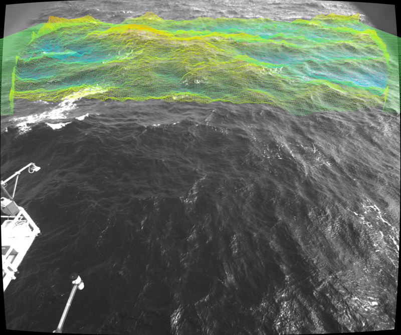

# WASSncplot

WASSncplot is a small tool to plot NetCDF 3D data generated with
[WASS](http://www.dais.unive.it/wass) on top of the original image files.



## Install

WASSncplot requires a Python 3.x interpreter and a set of 3rd-party libraries. The
best way to install all the required dependences is via [conda](https://docs.conda.io/en/latest/miniconda.html).

Once conda is installed, open a terminal and type the following:


```
$ conda env create -f environment.yml
$ conda activate wassncplot
```


## Usage

WASSncplot is a command-line tool. You can get a description of the available program
arguments with the following command: 

```
usage: wassncplot.py [-h] [-f FIRST_INDEX] [-l LAST_INDEX] [-b BASELINE]
                     [--scale SCALE] [--zmin ZMIN] [--zmax ZMAX]
                     [--alpha ALPHA] [--pxscale PXSCALE]
                     [--wireframe WIREFRAME] [--savexyz SAVEXYZ]
                     ncfile camdir configdir planefile P0cam out

positional arguments:
  ncfile                Input NetCDF4 file
  camdir                Image directory
  configdir             WASS config directory
  planefile             Mean sea-plane definition file
  P0cam                 P0cam.txt file (can be found in any output workdir
                        generated by WASS)
  out                   Where to store the produced images

optional arguments:
  -h, --help            show this help message and exit
  -f FIRST_INDEX, --first_index FIRST_INDEX
                        First data index to process
  -l LAST_INDEX, --last_index LAST_INDEX
                        Last data index to process
  -b BASELINE, --baseline BASELINE
                        Baseline of the stereo system (use this option to
                        override the baseline value stored in the netcdf file)
  --scale SCALE         Output image reduction scale
  --zmin ZMIN           Minimum 3D point elevation (used for colorbar limits)
  --zmax ZMAX           Maximum 3D point elevation (used for colorbar limits)
  --alpha ALPHA         Surface transparency [0..1]
  --pxscale PXSCALE     Desktop pixel scale (set to 0.5 if using OSX with
                        retina display)
  --wireframe WIREFRAME
                        Render surface in wireframe
  --savexyz SAVEXYZ     Save mapping between image pixels and 3D coordinates
                        as numpy data file
```


For example, the command:

```
$ python wassncplot.py ./wass_20140327_0910/3D/wass__20140327_091000.nc ./wass_20140327_0910/input/cam0_left/ ./wass_20140327_0910/config/ ./wass_20140327_0910/output/000000_wd/plane_avg.txt ./wass_20140327_0910/output/000000_wd/P0Cam.txt ./out -f 55 -l 70 
```

Will render the sequence stored in  ```./wass_20140327_0910/3D/wass__20140327_091000.nc```  from frame 55 to 70, using
the plane file defined in  ```./wass_20140327_0910/output/000000_wd/plane_avg.txt```, the Cam0 projection matrix defined
in ```./wass_20140327_0910/output/000000_wd/P0Cam.txt``` and the image data stored in ```./wass_20140327_0910/input/cam0_left/```.  The produced output images will be placed in ```./out```

*** Note for OSX users: *** If using retina display you may get uncorrect results. To solve this, try setting ```--pixscale 0.5```


## License

```
Copyright (C) 2019 Filippo Bergamasco 

wassncplot is free software: you can redistribute it and/or modify
it under the terms of the GNU General Public License as published by
the Free Software Foundation, either version 3 of the License, or
(at your option) any later version.

WASS is distributed in the hope that it will be useful,
but WITHOUT ANY WARRANTY; without even the implied warranty of
MERCHANTABILITY or FITNESS FOR A PARTICULAR PURPOSE.  See the
GNU General Public License for more details.

You should have received a copy of the GNU General Public License
along with this program.  If not, see <http://www.gnu.org/licenses/>.
```